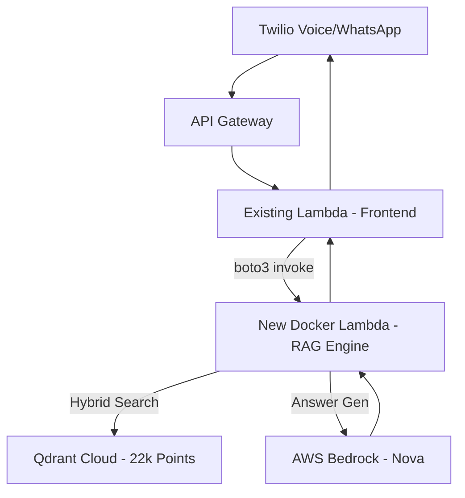

# 📝 Voice RAG Project: Summary of Improvements & Deployment

This project has been upgraded from a local prototype to a **Cloud-Native AI Voice Helpline**. Below is a comprehensive record of all files created, configurations updated, and infrastructure deployed.

---

## 🏗️ Architecture Overiew



---

## 📂 1. Core Implementation Files

| File | Type | Description |
|:--- |:--- |:--- |
| `voice_rag_server.py` | Python | **Unified FastAPI Server** that handles webhooks for both Voice calls and WhatsApp messages. Supports both local and cloud Qdrant. |
| `lambda_voice_rag/lambda_function.py` | Python | **AWS Lambda Handler** optimized for container execution. Orchestrates the RAG flow (Embed → Search → Generate). |
| `migrate_to_qdrant_cloud.py` | Python | **Data Migration Utility** that successfully transferred 22,287 scheme vectors to the cloud. |
| `preload_models.py` | Python | **Build Utility** used during Docker construction to bake the BGE model into the image for zero-latency startup. |

---

## 🐳 2. Docker & Deployment Infrastructure

| File | Purpose |
|:--- |:--- |
| `Dockerfile.lambda` | **Containerizes the RAG Engine**. Bypasses the 250MB Lambda ZIP limit to host the 1.3GB BGE-large model. |
| `deploy_lambda.ps1` | **Deployment Automation**. One-click script to build, push to ECR, and update Lambda. |
| `docker-compose.yml` | **Local Testing**. Spins up a local Qdrant Dashboard and the Voice RAG server simultaneously. |
| `requirements_lambda.txt` | **Optimized Dependency List** for the cloud environment. |

---

## ☁️ 3. Cloud Infrastructure Status

### Qdrant Cloud (Database)
*   **Region**: `eu-central-1` (Frankfurt)
*   **Collection**: `schemes_hybrid`
*   **Points**: **22,287** (Dense + Sparse/BM25)
*   **Status**: **LIVE & VERIFIED**

### AWS ECR (Image Registry)
*   **Region**: `eu-north-1` (Stockholm)
*   **Repo**: `gov-schemes-lambda`
*   **Format**: OCI-compliant linux/amd64
*   **Status**: **LIVE**

### AWS Lambda (Compute)
*   **Name**: `gov-schemes-voice-rag`
*   **Memory**: 3008 MB (Regional max)
*   **Timeout**: 5 minutes
*   **Role**: Attached BedrockFullAccess, S3FullAccess, TranscribeFullAccess
*   **Status**: **LIVE & HEALTH-CHECK PASSING**

---

## 🔧 4. How to Connect the Bridge

To use this logic in your **Existing Lambda**, add this "Magic Function":

```python
import boto3, json

def get_rag_answer(user_query: str) -> str:
    client = boto3.client('lambda', region_name='eu-north-1')
    response = client.invoke(
        FunctionName='gov-schemes-voice-rag',
        Payload=json.dumps({
            "rawPath": "/debug/query",
            "body": json.dumps({"query": user_query}),
            "headers": {"content-type": "application/json"}
        })
    )
    result = json.loads(response['Payload'].read())
    return json.loads(result.get('body', '{}')).get('answer')
```

---

## ✅ Final State
The project is now fully decoupled. You can update your dataset or improve your AI model by simply re-running the Docker build/push, without ever needing to change your Twilio webhooks or API Gateway configuration.
